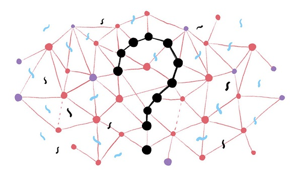
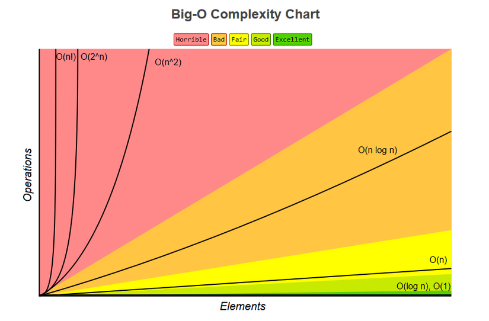

# Data_Structures_and_Algorithms

## Programs = Data Structures + Algorithms 

## Mục lục

[I. Structures](#structures)

[II. Algorithms](#algorithms)
- [1. Tầm quan trọng của thuật toán](#tamquantrongthuattoan)
- [2. Độ phức tạp thuật toán](#dophuctapthuattoan)

<a name="structures"></a>
## Structures


<a name="algorithms"></a>
## Algorithms
<a name ="tamquantrongthuattoan"></a>
### Tầm quan trọng của thuật toán (Algorithms)



  "Thuật toán là gì?" - Thuật toán là một quá trình tính toán cụ thể trong đó lấy một hay nhiều giá trị đầu vào (input) vf cho ra một hay nhiều kết quả (output)
  
Có rất nhiều loại thuật toán và chúng được phân loại theo các tính năng khác nhau, phổ biến nhất là:

- Thuật toán tìm kiếm: Đây là thuật toán được áp dụng để tìm kiếm dữ liệu, thông tin trong một tập hợp bao gồm các phần tử khác nhau.
- Thuật toán sắp xếp: Đây là thuật toán được dùng để sắp xếp thứ tự từng phần tử trong tập hợp một cách khoa học, đáp ứng yêu cầu ban đầu.
- Thuật toán đồ thị: Thuật này được sử dụng để xử lý các dạng bài có sử dụng đồ thị.

Vai trò của  thuật toán đối với thực tiễn là không hề nhỏ. Thuật toán giúp lập trình viên đánh giá phần mềm mới hoạt động có hiệu quả không.

- Thuật toán là phần quan trọng, không thể thiếu khi tiếp cận các vấn đề liên quan đến lĩnh vực lập trình.
- Thuật toán tốt mang đến hiệu quả cao, giúp các chương trình hoạt động hiệu quả với tốc độ xử lý nhanh chóng, tiết kiệm tài nguyên.
- Thuật toán giúp lập trình viên hiểu rõ và sâu hơn về ứng dụng, chương trình.

Nếu ta viết một phần mềm, ta sẽ phải đánh giá được phần mềm đó sẽ hoạt động nhanh chậm ra sao. Những đánh giá như vậy sẽ kém chính xác hơn nhiều nếu ta không có hiểu biết về thời gian chạy hay độ phức tạp.

Thêm nữa, hiểu biết kỹ càng về thuật toán của những gì ta đang làm sẽ giúp ta dự đoán những trường hợp đặc biệt khiến phần mềm chạy chậm đi hay xảy ra lỗi.

<a name="dophuctapthuattoan"></a>
### Độ phức tạp thuật toán (Complexity)



Một trong những yếu tố quan trọng nhất của một thuật toán là việc nó chạy nhanh hay chậm. Nghĩ ra một thuật để giải một bài toán là việc dễ, nhưng để nó có ý nghĩa trong thực tế, thì thuật toán phải chạy đủ nhanh. Tốc độ của một thuật tùy thuộc vào tốc độ máy cũng như chi tiết cài đặt, các nhà khoa học máy tính thường đề cập đến runtime (thời gian chạy) tương ứng với kích thước input. Ví dụ, nếu input gồm N số, một thuật toán có thời gian chạy tỉ lệ thuận với N^2 được kí hiệu là O(N^2). Ký hiệu này nghĩa là, khi máy tính chạy một chương trình cài đặt thuật toán trên với độ lớn input là N, chương trình sẽ tốn C∗N^2 giây, với C là một hằng số không phụ thuộc vào kích thước input.

Tuy nhiên, thời gian chạy thực tế của nhiều thuật toán phức tạp còn phụ thuộc nhiều yếu tố khác ngoài độ lớn input. Ví dụ, một thuật toán sắp xếp sẽ chạy nhanh hơn nhiều khi được xử lí một dãy số đã sắp xếp sẵn so với khi phải giải quyết một dãy số lộn xộn. Từ đó sinh ra hai khái niệm: thời gian chạy tối đa và thời gian chạy trung bình. Thời gian chạy tối đa là thời gian thuật toán cần để xử lí input trong trường hợp tồi nhất. Thời gian chạy trung bình là thời gian trung bình cho mọi input có thể xuất hiện. Trong 2 thuật ngữ, thời gian tối đa thường dễ phân tích hơn, nên nó thường được sử dụng để đánh giá các thuật toán. Việc tính toán độ phức tạp nhiều lúc không đơn giản vì ta không thể kiểm tra được hết mọi trường hợp.

Ước tính thời gian chạy của các thuật, N=100

- O(Log(N)): 10^−7 giây
- O(N): 10−6 giây
- O(N∗Log(N)): 10^−5 giây
- O(N^2): 10^−4 giây
- O(N^6): 3 phút
- O(2^N): 1014 năm
- O(N!): 10142 năm

Cách tính độ phức tạp tính toán của giải thuật: O(f(n))

• Việc xác định độ phức tạp tính toán của giải thuật trong thực tế có thể tính bằng một số quy tắc đơn giản sau:

– Quy tắc bỏ hằng số:
```
        T(n) = O(c.f(n)) = O(f(n)) với c là một hằng số dương
```
– Quy tắc lấy max:
```
        T(n) = O(f(n)+ g(n)) = O(max(f(n), g(n)))
```
– Quy tắc cộng:
```
        T1(n) = O(f(n))                     T2(n) = O(g(n))

        T1(n) + T2(n) = O(f(n) + g(n))
```
– Quy tắc nhân:
```
        Đoạn chương trình có thời gian thực hiện T(n)=O(f(n))

        Nếu thực hiện k(n) lần đoạn chương trình với k(n) = O(g(n)) thì độ phức tạp sẽ là O(g(n).f(n))
 ```
